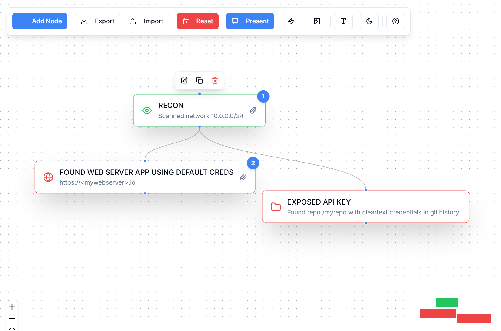
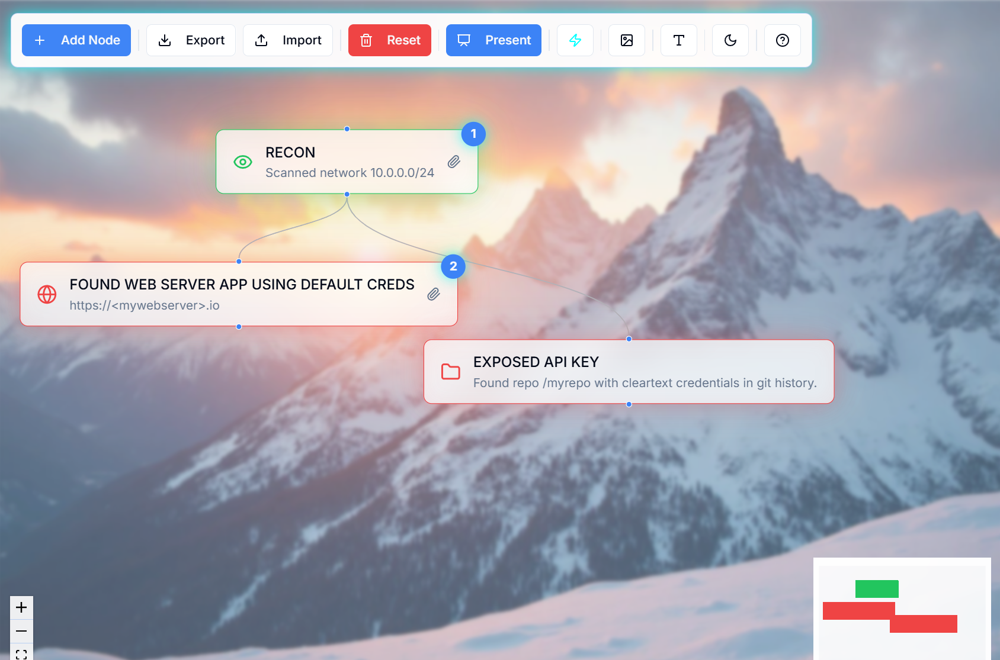

# Red Team Attack Diagram Tool

[](https://choosealicense.com/licenses/mit/)
[](https://red.michaelnieto.com)
[](https://reactjs.org/)
[](https://web.dev/progressive-web-apps/)

A powerful, browser-based Progressive Web App (PWA) for creating and managing red team attack diagrams. Built with React Flow, this application provides an intuitive interface for visualizing attack paths, tactics, and techniques with zero backend dependencies. Install it like a native app and run it completely offline.

**Live Demo:** [red.michaelnieto.com](https://red.michaelnieto.com)

## 📸 Screenshots

### Example Workflow


### Custom Theme Options



### Presentation Mode


## ✨ Features

### Core Functionality
- **Full-Featured Diagram Editor**: Powered by React Flow with smooth interactions
- **Custom Node Creation**: Add nodes with custom labels, colors, and icons
  - Choose from 36+ professional icons (Shield, Network, Terminal, Cloud, etc.)
  - Full color customization with color picker
  - Any custom label text for your attack stages
- **Flexible Node Types**: Create any attack stage nodes you need (Initial Access, C2, Lateral Movement, Execution, Privilege Escalation, Objective, or custom stages)
- **Auto-Save**: Diagrams automatically persist to browser localStorage
- **Import/Export**: Save and load diagrams as JSON files
- **Multiple Diagrams**: Create and manage multiple attack scenarios

### Customization
- **Custom Icons**: 36+ professional icons to choose from for each node (Shield, Network, Terminal, Target, Key, Database, Server, Cloud, and more)
- **Custom Colors**: Full color picker for node customization
- **Background Themes**: Multiple built-in backgrounds (abstract, mountains, nature, night city)
- **Neon Mode**: Toggle cyberpunk-style neon aesthetics
- **Font Customization**: Adjust font family and size
- **Dark/Light Mode**: Seamless theme switching

### Advanced Features
- **Progressive Web App (PWA)**: Install as a native app on desktop or mobile
- **Fully Offline-Capable**: Works 100% offline after installation - perfect for air-gapped environments
- **Attachment Management**: Add files, links, and notes to nodes
- **Presentation Mode**: Clean view for presenting diagrams
- **Responsive Design**: Works on desktop and mobile devices
- **No Backend Required**: Complete client-side application with localStorage and IndexedDB
- **Auto-Updates**: Service worker automatically updates to latest version

## 🛠️ Technology Stack

- **Frontend Framework**: React 18.3 with TypeScript
- **Build Tool**: Vite
- **PWA Support**: vite-plugin-pwa + Workbox
- **Diagramming**: React Flow 11
- **UI Components**: Radix UI + shadcn/ui
- **Styling**: Tailwind CSS with custom design system
- **State Management**: React hooks + Context API
- **Local Storage**: IndexedDB for diagram persistence
- **Routing**: React Router v6
- **Icons**: Lucide React
- **Forms**: React Hook Form + Zod validation
- **Utilities**: date-fns, clsx, tailwind-merge

## 🚀 Getting Started

### Prerequisites

- Node.js 18.x or higher
- npm or bun package manager

### Installation

1. **Clone the repository**
   ```bash
   git clone <YOUR_GIT_URL>
   cd <YOUR_PROJECT_NAME>
   ```

2. **Install dependencies**
   ```bash
   npm install
   # or
   bun install
   ```

3. **Start the development server**
   ```bash
   npm run dev
   ```

4. **Open your browser**
   Navigate to `http://localhost:8080`

### Installing as a PWA

The app can be installed as a Progressive Web App for offline use:

**Desktop (Chrome, Edge, Brave):**
1. Visit the app in your browser
2. Look for the install icon (⊕) in the address bar
3. Click "Install" to add it as a native app
4. Access from your Start Menu or Applications folder

**Mobile (iOS Safari):**
1. Visit the app in Safari
2. Tap the Share button
3. Select "Add to Home Screen"
4. Tap "Add" to install

**Mobile (Android Chrome):**
1. Visit the app in Chrome
2. Tap the menu (⋮)
3. Select "Install app" or "Add to Home Screen"
4. Tap "Install"

Once installed, the app works completely offline with all features available.

### Available Scripts

- `npm run dev` - Start development server with hot reload
- `npm run build` - Build for production
- `npm run preview` - Preview production build locally
- `npm run lint` - Run ESLint

## 📁 Project Structure

```
src/
├── components/          # React components
│   ├── ui/             # shadcn/ui components
│   ├── AddNodeDialog.tsx
│   ├── DiagramEditor.tsx
│   ├── Toolbar.tsx
│   └── ...
├── hooks/              # Custom React hooks
├── nodes/              # React Flow custom nodes
├── pages/              # Route pages
├── types/              # TypeScript type definitions
├── utils/              # Utility functions
│   ├── indexedDB.ts   # Database operations
│   ├── storage.ts     # LocalStorage helpers
│   └── validation.ts  # Schema validation
├── App.tsx             # Main app component
├── index.css           # Global styles & design system
└── main.tsx            # Application entry point
```

## 🌐 Deployment

### Option 1: Lovable (Recommended)

The easiest way to deploy this project:

1. Open your [Lovable Project](https://lovable.dev/projects/c6bea9df-92e9-4881-92a3-302e13620985)
2. Click the **Publish** button (top right on desktop, bottom right on mobile)
3. Your app is live instantly!

**Custom Domain Setup:**
- Navigate to Project → Settings → Domains
- Click "Connect Domain"
- Follow the instructions to connect your custom domain (e.g., red.michaelnieto.com)
- Requires a paid Lovable plan

### Option 2: GitHub Pages

1. **Install gh-pages**
   ```bash
   npm install -D gh-pages
   ```

2. **Add deploy scripts to package.json**
   ```json
   "scripts": {
     "predeploy": "npm run build",
     "deploy": "gh-pages -d dist"
   }
   ```

3. **Deploy**
   ```bash
   npm run deploy
   ```

4. **Enable GitHub Pages**
   - Go to repository Settings → Pages
   - Select `gh-pages` branch
   - Your app will be live at `https://[username].github.io/[repo-name]/`

### Option 3: Vercel

1. **Install Vercel CLI**
   ```bash
   npm install -g vercel
   ```

2. **Deploy**
   ```bash
   vercel
   ```

   Or connect your GitHub repository at [vercel.com](https://vercel.com) for automatic deployments.

### Option 4: Netlify

1. **Build the project**
   ```bash
   npm run build
   ```

2. **Deploy via Netlify CLI**
   ```bash
   npm install -g netlify-cli
   netlify deploy --prod --dir=dist
   ```

   Or drag and drop the `dist` folder to [Netlify Drop](https://app.netlify.com/drop).

### Option 5: Custom Static Hosting

Build the project and upload the `dist` folder to any static file hosting service:

```bash
npm run build
```

The `dist` folder contains all static files ready for deployment to:
- AWS S3 + CloudFront
- Google Cloud Storage
- Azure Static Web Apps
- Any web server (Apache, Nginx, etc.)

## 📖 Usage

### Creating Your First Diagram

1. **Add Nodes**: Click the "+" button or use the toolbar to add attack stage nodes
2. **Connect Nodes**: Drag from one node's edge to another to create connections
3. **Customize**: 
   - Double-click nodes to edit labels and descriptions
   - Choose custom icons from the icon picker
   - Add attachments, links, and notes
4. **Style**: Toggle neon mode, change backgrounds, and adjust fonts
5. **Save**: Your diagram auto-saves to the browser
6. **Export**: Download as JSON for backup or sharing

### Keyboard Shortcuts

- `Delete` - Remove selected nodes/edges
- `Ctrl/Cmd + Z` - Undo (via browser)
- `Ctrl/Cmd + C/V` - Copy/paste nodes

### Tips

- Use different node colors to represent different threat actors or attack phases
- Add detailed descriptions and attachments to document TTPs
- Use presentation mode for clean, distraction-free views
- Export regularly to backup your diagrams
- Import diagrams to share with your team

## 🤝 Contributing

Contributions are welcome! Here's how you can help:

1. **Fork the repository**
2. **Create a feature branch**
   ```bash
   git checkout -b feature/amazing-feature
   ```
3. **Commit your changes**
   ```bash
   git commit -m 'Add some amazing feature'
   ```
4. **Push to the branch**
   ```bash
   git push origin feature/amazing-feature
   ```
5. **Open a Pull Request**

### Reporting Issues

Found a bug or have a feature request? Please open an issue on GitHub with:
- Clear description of the problem/feature
- Steps to reproduce (for bugs)
- Expected vs actual behavior
- Screenshots if applicable

### Code Guidelines

- Follow the existing code style
- Write meaningful commit messages
- Add comments for complex logic
- Test your changes thoroughly
- Update documentation as needed

## 📄 License

This project is licensed under the MIT License - see the [LICENSE](LICENSE) file for details.

**What this means:**
- ✅ Commercial use allowed
- ✅ Modification allowed
- ✅ Distribution allowed
- ✅ Private use allowed
- ❌ No liability
- ❌ No warranty

## 👤 Creator

**Michael Nieto**

Red team professional and security tool developer. This tool was created to streamline the process of documenting and visualizing attack paths during security assessments.

- LinkedIn: [linkedin.com/in/nietomichael](https://www.linkedin.com/in/nietomichael/)
- Website: [michaelnieto.com](https://michaelnieto.com)

## 💬 Support

Need help or have questions?

- **Documentation**: Check this README and the in-app Help page
- **Issues**: [Open an issue](https://github.com/[your-username]/[repo-name]/issues) on GitHub
- **Discussions**: Join conversations in the repository's Discussions tab
- **LinkedIn**: Connect with me for questions or collaboration

## 🙏 Acknowledgments

Built with:
- [React Flow](https://reactflow.dev/) - Powerful diagram library
- [shadcn/ui](https://ui.shadcn.com/) - Beautiful component system
- [Radix UI](https://www.radix-ui.com/) - Unstyled, accessible components
- [Lucide Icons](https://lucide.dev/) - Elegant icon set
- [Lovable](https://lovable.dev/) - AI-powered development platform

---

**⭐ Star this repo if you find it useful!**

Made with ❤️ for the red team community
